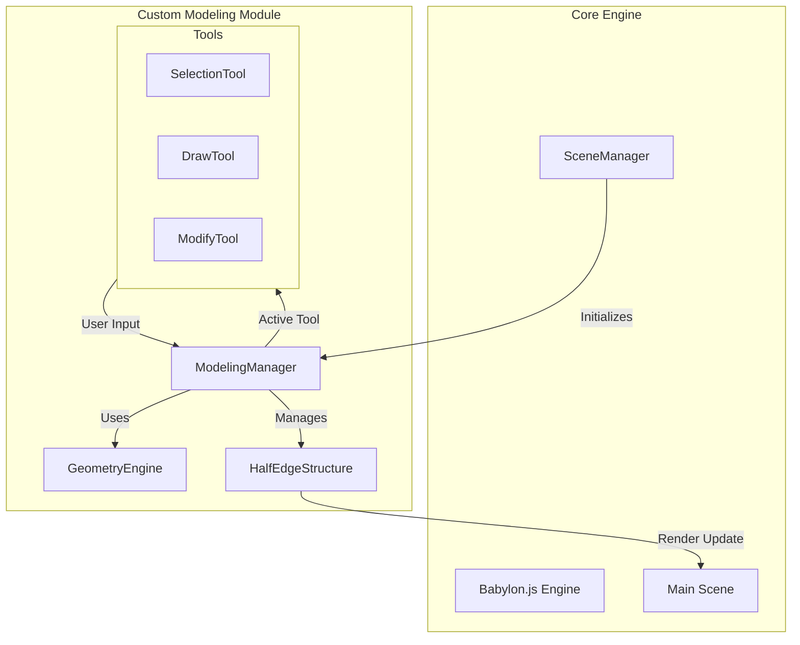

# Archiple Custom Modeling Tool Development Guide

## 1. Executive Summary
This document serves as the comprehensive technical specification for implementing a "SketchUp-like" custom modeling environment within Archiple. The goal is to transition from the current `CustomModelingPage.tsx` shell to a robust, production-grade 3D modeling editor that seamlessly integrates with Archiple's core architecture.

## 2. Technical Architecture

### 2.1. System Overview
The Custom Modeling module will operate as a specialized "sub-editor" that borrows the core rendering engine but maintains its own interaction logic and state management.



### 2.2. Core Modules

#### 2.2.1. `ModelingManager` (State Orchestrator)
*   **Responsibility**: Manages the lifecycle of the modeling session, tool activation, undo/redo stack, and communication with the main `SceneManager`.
*   **State Management**: Uses a dedicated Zustand store (`useModelingStore`) to track:
    *   `activeTool`: Current selected tool.
    *   `selection`: Set of selected faces, edges, and vertices.
    *   `history`: Stack of operations for undo/redo.
    *   `snapping`: Current inference state.

#### 2.2.2. `GeometryEngine` (The Kernel)
*   **Responsibility**: Pure mathematical and topological operations. It does NOT depend on Babylon.js meshes directly but operates on the internal `HalfEdgeStructure`.
*   **Key Methods**:
    *   `extrudeFace(face, distance)`
    *   `splitEdge(edge, point)`
    *   `mergeVertices(v1, v2)`
    *   `triangulateFace(face)`

### 2.3. Data Structures: Half-Edge Topology
To support advanced editing (Push/Pull, healing geometry), we must use a Half-Edge Data Structure (DCEL).

```typescript
// Core Types
type VertexID = string;
type EdgeID = string;
type FaceID = string;

interface HVertex {
  id: VertexID;
  position: Vector3; // Babylon Vector3
  outgoingEdge: EdgeID; // Reference to one half-edge starting here
}

interface HEdge {
  id: EdgeID;
  origin: VertexID;      // Start vertex
  twin: EdgeID;          // Opposite half-edge
  face: FaceID;          // Face this edge belongs to
  next: EdgeID;          // Next edge in the face loop
  prev: EdgeID;          // Previous edge in the face loop
}

interface HFace {
  id: FaceID;
  edge: EdgeID;          // Reference to one half-edge on this face
  normal: Vector3;       // Cached normal
  materialId: string;    // Reference to material asset
  uvs: Vector2[];        // Texture coordinates
}

interface HMesh {
  vertices: Map<VertexID, HVertex>;
  edges: Map<EdgeID, HEdge>;
  faces: Map<FaceID, HFace>;
}
```

## 3. Feature Specifications

### 3.1. Advanced Selection System
*   **Raycasting Strategy**:
    *   **Priority**: Vertex > Edge > Face.
    *   **Thresholds**: Vertices (10px radius), Edges (5px buffer).
*   **Visual Feedback**:
    *   **Pre-highlight**: Hover effect showing exactly what will be selected.
    *   **Selection State**: Selected elements rendered with a distinct color (e.g., Archiple Blue `#3B82F6`) and overlay wireframe.

### 3.2. Drawing Tools (Creation)

#### 3.2.1. Line Tool (Pencil)
*   **Logic**:
    1.  User clicks Point A.
    2.  User moves cursor -> Show "Ghost Line" to current mouse position.
    3.  **Inference**: Snap to X/Y/Z axes (Red/Green/Blue lines). Snap to existing geometry.
    4.  User clicks Point B.
    5.  **Auto-Face**: If the new edge closes a planar loop, the `GeometryEngine` automatically creates a face.
    6.  **Edge Splitting**: If the line crosses an existing edge, split both edges at the intersection.

#### 3.2.2. Rectangle Tool
*   **Logic**:
    1.  Click Corner 1.
    2.  Drag to Corner 2.
    3.  **Input**: Allow typing dimensions (e.g., "3000, 2000") to set precise size.
    4.  Create 4 vertices, 4 edges, and 1 face immediately.

### 3.3. Modification Tools (Editing)

#### 3.3.1. Push/Pull (Extrude) - *Critical Feature*
*   **Logic**:
    1.  User hovers a face -> Face highlights with a "dot pattern".
    2.  User clicks face.
    3.  User moves mouse -> Face moves along its normal vector.
    4.  **Topology Update**:
        *   Create side faces connecting original edges to new edges.
        *   If pushed *into* the mesh and coplanar with a back face, perform a boolean subtraction (cut hole).
    5.  User clicks to confirm distance.

#### 3.3.2. Move Tool
*   **Context Aware**:
    *   **Vertex**: Moves the point, stretching connected edges.
    *   **Edge**: Moves the edge, rotating connected faces.
    *   **Face**: Moves the plane, extending side geometry.
*   **Auto-Fold**: If a move operation makes a face non-planar, automatically triangulate (fold) the face to maintain valid geometry.

#### 3.3.3. Offset Tool
*   **Logic**:
    1.  Select a face.
    2.  Calculate inset polygon based on mouse distance.
    3.  Create new edges on the face.
    4.  Result: The face is split into an "outer ring" and an "inner polygon".

## 4. Integration Plan

### 4.1. Entry Point
*   **Access**: From the main Editor, user selects "Custom Modeling" mode.
*   **Context**: User can choose to edit an existing object (load its geometry) or start fresh.

### 4.2. Serialization (Saving)
*   **Format**: We need a robust JSON format to save the `HMesh` structure, preserving topology for future edits.
*   **Export**: For use in the main scene, the `HMesh` is compiled into a standard Babylon `.glb` or serialized `Mesh` data.
    *   *Note*: Keep the source `HMesh` data stored in `metadata` so it remains editable later.

### 4.3. Asset Management
*   **Materials**: Integrate with `AssetManager` to apply Archiple's standard material library to specific faces.
*   **Components**: Allow saving the modeled object as a reusable "Component" in the user's library.

## 5. Implementation Roadmap (Detailed)

### Phase 1: Core Infrastructure (Weeks 1-3)
*   [ ] **Week 1**: Set up `ModelingManager` and `GeometryEngine` skeletons. Implement `HalfEdge` data structure classes.
*   [ ] **Week 2**: Implement `MeshConverter` (HalfEdge <-> Babylon VertexData). Verify rendering of a simple cube defined in HalfEdge.
*   [ ] **Week 3**: Implement robust Raycasting (Vertex/Edge/Face) and the `SelectionTool`.

### Phase 2: Basic Modeling (Weeks 4-6)
*   [ ] **Week 4**: `LineTool` with axis locking and basic snapping (Endpoint).
*   [ ] **Week 5**: `RectangleTool` and "Auto-Face" detection logic (finding closed loops).
*   [ ] **Week 6**: `MoveTool` for vertices and edges. Implement "Auto-Fold" logic.

### Phase 3: Advanced Features (Weeks 7-9)
*   [ ] **Week 7**: `PushPullTool` (Extrusion logic). This is complex and requires careful topology handling.
*   [ ] **Week 8**: `OffsetTool` and `TapeMeasureTool`.
*   [ ] **Week 9**: Boolean operations (cutting holes with Push/Pull).

### Phase 4: Polish & Integration (Weeks 10-12)
*   [ ] **Week 10**: UI/UX polish (Cursors, Tooltips, Dimension Input Box).
*   [ ] **Week 11**: Integration with `SceneManager` (Save/Load/Undo/Redo).
*   [ ] **Week 12**: Performance profiling and optimization (WASM for GeometryEngine if needed).

## 6. UX/UI Guidelines
*   **Inference Cues**:
    *   🟩 Green Dot: Endpoint
    *   🟦 Cyan Dot: Midpoint
    *   🟥 Red Dot: On Edge
    *   🟦 Blue Surface: On Face
*   **Input Box**: A "Measurement Box" in the bottom-right corner (Vats) that accepts typed values at any time during an operation (e.g., typing "500" during a Push/Pull sets the distance to 500mm).
*   **Shortcuts**: Match industry standards (Space=Select, L=Line, R=Rect, P=Push/Pull, M=Move, T=Tape).
